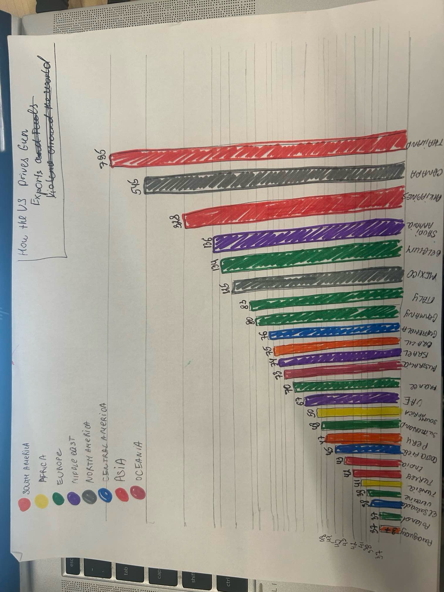

| [home page](https://mashaandreieva.github.io/My-Portfolio/) | [visualizing debt](visualizing-government-debt) | [critique by design](critique-by-design) | [final project I](final-project-part-one) | [final project II](final-project-part-two) | [final project III](final-project-part-three) |

# Worldwide Impact: Cumulative volume of US semiautomatic firearm exports, 2005–2022

## Step one: The Visualization

I used the following article for my visualization: How the US Drives Gun Exports and Fuels Violence Around the World. Here is the link: https://www.bloomberg.com/graphics/2023-us-made-gun-exports-shootings-violence-sig-sauer/

I chose this particular visualization design because I wanted to analyze trends in firearm exports and draw comparisons to gun violence incidents in countries mentioned in the chart. Moreover, as a policy student this data might help make informed decisions when it comes to the regulation of international trade in firearms. 

## Step two: The Critique

This visualization could be intended for anyone interested in the global impact of American firearm exports. This includes policymakers involved in international relations, security, or trade, who can use this data to make informed decisions. 
Moreover, media professionals and NGOs can use this information to educate general public and raise awareness about the potential consequences of firearms on human rights, conflict resolution, and other issues.

While, the visualization conveys general trends, it might be challenging to compare data across different countries due to the varying scale.  The radial bar chart visualizes the cumulative volume of U.S. semiautomatic firearm exports between 2005 and 2022. While this chart provides a broad overview of export volumes by country, it is difficult to use for the exports comparison between different countries and across the years. The chart design makes it difficult to compare countries with similar export volumes due to the varying bar lengths, width and angles, for example the bar for Thailand equals to 795k while the bar for the Philippines equals to 328k which is almost half a difference however by looking at the chart it does not seem like it. Additionally, although the chart presents data for the period between 2005 to 2022, it only provides a cumulative total, offering a one-time snapshot that doesn't allow for analysis of trends in exports over time. 
It could be easier and faster for viewers to understand it if it had clear units of measurement, i.e. number of firearms or a dollar value? 

While the radial chart has a consistent color scheme, there are some areas where the chart could be improved to enhance understandability.The scale of the chart is easy to understand when looking at each country individually, however not easy to interpret when comparing different countries to each other. This is explained by the very similar height and width of each bar even when the bars are quite different from each other. Perhaps adding some interactive elements to each bar, such as more details about the country it represents and trends over time, would make the visualization more engaging for viewers. 

I think the visualization is likely to be true as it is published by a trustworthy source: US Census Bureau.

Aesthetics is a very subjective notion. In my opinion, I would improve the design of visualization. I think having a map instead of a radial chart is "more visually appealing" to look at.  
I would include a text note summarizing trends and maybe giving more information regarding factors behind some countries importing more/less of US firearms. 

## Step three: Sketch a Solution

Initially, I chose a bar chart for the visualization redesign. Each color represented a different geographic region, with different bars corresponding to various countries. The y-axis displayed the number of firearms exported. 

## Step four: Test the Solution

Interview#1 (student, mid 20's):

The chart is too colorful and not very aesthetically pleasing. It does not really make sense to divide countries into regions. Perhaps a bubble chart would do better with this information. It also does not mention the metrics measure.
The scale of the chart is not very consistent, which makes it more difficult to emphasize differences between countries. 

Maybe adding a brief note to the chart would make it clearer to understand why some countries import more US guns than others.

Interview#2 (student, mid 20's):

The title of the chart might be a bit strong. It conveys a clear message and highlights the importance of the issue however at the same time it is a bit provocative, which adds an emotional aspect to it.  It is also a bit unclear, perhaps the title like “US Guns Exports by Country (Ranked by Volume)” would add more transparency. It would also help readers to immediately understand what the chart describes.
The x-axis does not mention the number that is being measured by the chart, what do these numbers represent. Number of guns exported? Or a dollar value?

Synthesis: 

Based on this feedback, I came up with the following changes:
- Changed the title of the chart
- Switched to a different layout: a map

## Step five: Build the Solution

  <noscript>
    
  </noscript>
  <object class='tableauViz'  style='display:none;'>
    <param name='host_url' value='https%3A%2F%2Fpublic.tableau.com%2F' /> 
    <param name='embed_code_version' value='3' /> 
    <param name='site_root' value='' />
    <param name='name' value='Book3_17266824897160&#47;Sheet1' />
    <param name='tabs' value='no' /><param name='toolbar' value='yes' />
    <param name='static_image' value='https:&#47;&#47;public.tableau.com&#47;static&#47;images&#47;Bo&#47;Book3_17266824897160&#47;Sheet1&#47;1.png' /> 
    <param name='animate_transition' value='yes' />
    <param name='display_static_image' value='yes' />
    <param name='display_spinner' value='yes' />
    <param name='display_overlay' value='yes' />
    <param name='display_count' value='yes' />
    <param name='language' value='en-US' />
    <param name='filter' value='publish=yes' />
  </object>
                
  
