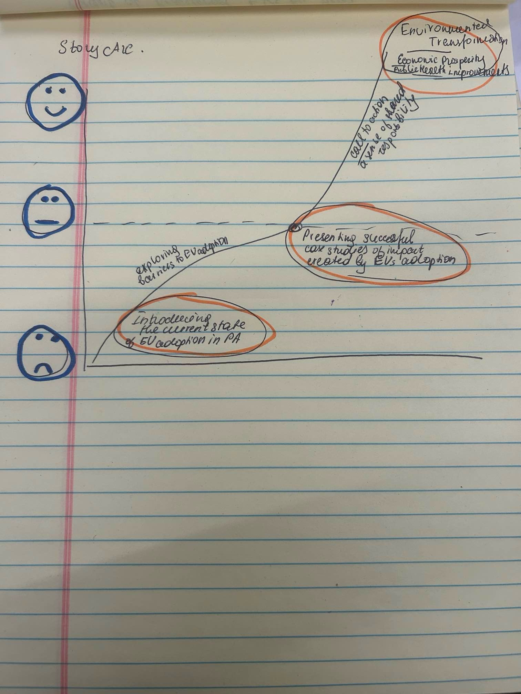

| [home page](https://mashaandreieva.github.io/My-Portfolio/) | [visualizing debt](visualizing-government-debt) | [critique by design](critique-by-design) | [final project I](final-project-part-one) | [final project II](final-project-part-two) | [final project III](final-project-part-three) |

> Important note: this template includes major elements of Part I, but the instructions on Canvas are the authoritative source.  Make sure to read through the assignment page and review the rubric to confirm you have everything you need before submitting.  When done, delete these instructions before submitting.

# Outline
> A high-level summary

Title: "Electric Vehicle Adoption Rates and Charging Infrastructure Development in Rural vs. Urban Areas in Pennsylvania"
 

The transportation sector is the largest contributor to greenhouse gas emissions (GHG) in the USA, surpassing other industrial activities and even outweighing the combined emissions from commercial, agricultural and residential sectors. 

EVs present a promising solution for a significant reduction in GHG emissions. However, this strategy is only effective when reproduced on a mass scale. 

Over the past decade, both federal and state governments, including Pennsylvania, have been providing significant financial incentives to promote transition to EVs adoption. However despite these efforts, the adoption of electric vehicles is relatively far from mass market penetration. 

Several factors contribute to the slower than anticipated rate of EV adoption in PA: 

-	Affordability
Despite the decreasing costs of electric vehicles, the purchase price of EVs still remains higher than other conventional vehicles.

-	Lack of proper charging infrastructure
Potential buyers are reluctant to purchase EVs as they are aware of insufficient charging infrastructure.

-	Lack of Public Awareness about benefits brought by EVs
People simply might not be aware of the economic and environmental benefits of switching to EVs.

My project aims to explore the differences in EV adoption rates and charging infrastructure development in rural and urban areas in PA. 

My project will highlight the importance of EVs in terms of additional opportunities for economic development, public health improvements, brining more opportunities to rural areas of the state, creating more educational opportunities, etc. 

By presenting my story I aim to provide Pennsylvania policymakers with the information needed to make informed policy decisions related to EV adoption as well as funding allocations. I will also present projections of economic and environmental impacts. 

 The story can also be useful for the general public, especially those who still remain skeptical about the benefits of transitioning to EVs as transportation mode.

> A project structure  

Introduction: The Current Landscape of EVs in Pennsylvania

-	Overview of EVs adoption rates rural vs. urban in Pennsylvania
-	Current charging infrastructure map
-	Current state-level policies/incentives/programs

The Impact/Benefits of EVs adoption

-	Environmental benefits
-	Economic benefits

Some barriers to EV adoption

-	Affordability
-	Lack of proper charging infrastructure
-	Lack of public awareness on the issue

Policy recommendations

-	Public awareness and education campaigns
-	Targeted policies for more widespread EV adoption across the state

Call to Action

-	For policymakers: policy proposals and funding 
-	For the general public: Considering EV options

## Initial sketches
> Post images of your anticipated data visualizations (sketches are fine). They should mimic aspects of your outline, and include elements of your story.  

# The data
> A couple of paragraphs that document your data source(s), and an explanation of how you plan on using your data. 

Text here...

> A link to the publicly-accessible datasets you plan on using, or a link to a copy of the data you've uploaded to your Github repository, Box account or other publicly-accessible location. Using a datasource that is already publicly accessible is highly encouraged.  If you anticipate using a data source other than something that would be publicly available please talk to me first. 

| Name | URL | Description |
|------|-----|-------------|
|      |     |             |
|      |     |             |
|      |     |             |

# Method and medium
> In a few sentences, you should document how you plan on completing your final project. 

Text here...
