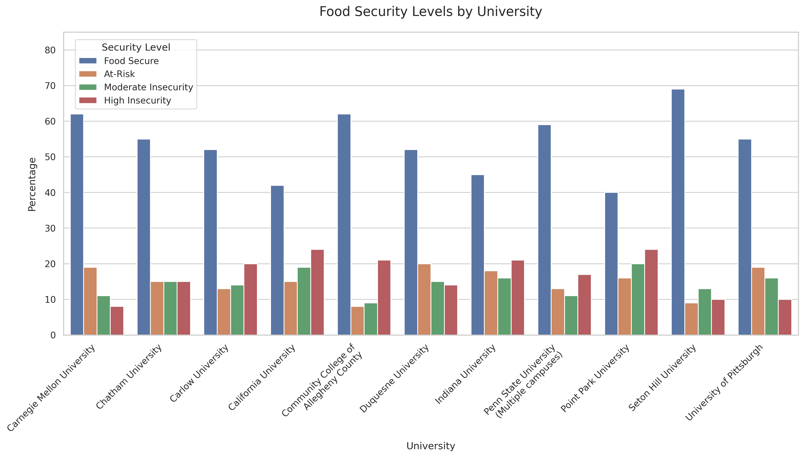
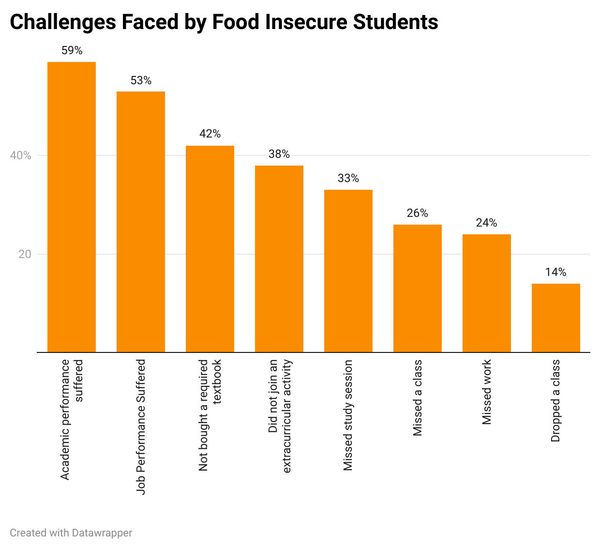
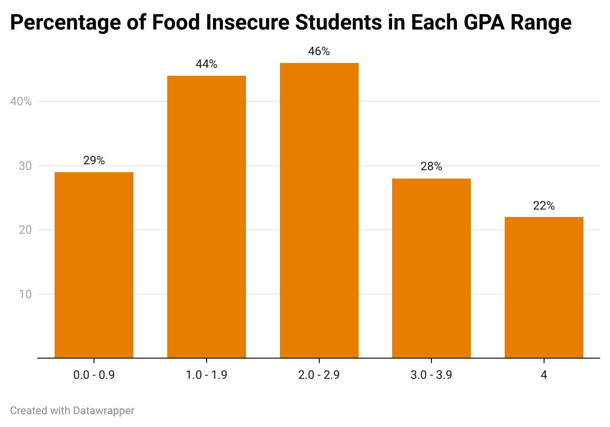
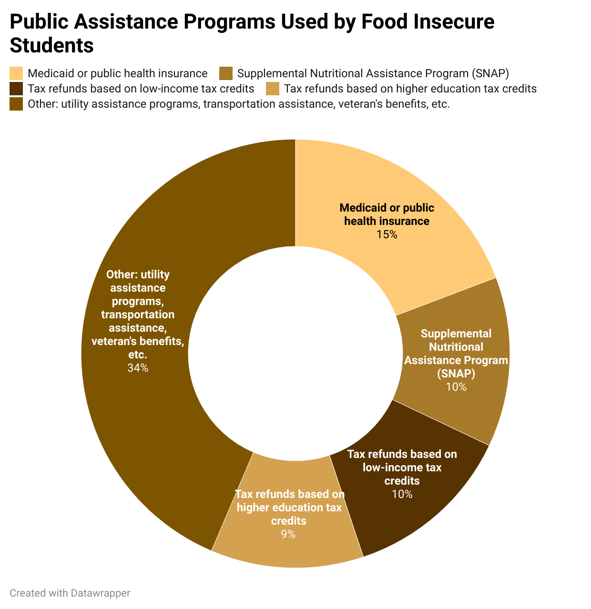

| [home page](https://mashaandreieva.github.io/My-Portfolio/) | [visualizing debt](visualizing-government-debt) | [critique by design](critique-by-design) | [final project I](final-project-part-one) | [final project II](final-project-part-two) | [final project III](final-project-part-three) |

# Wireframes / storyboards
> Shorthand (work in progress): https://carnegiemellon.shorthandstories.com/13d34e78-2b62-48e2-848d-1c2be20c485b/index.html wpo
## The Untold Story of Food Insecurity Among College Students 
## From National Trends to Pennsylvania-Based Solutions

Understanding the Crisis

According to the United States Department of Agriculture, Food Insecurity is defined as a lack of access to enough food needed for an active healthy lifestyle. Food insecurity is considered to be one of the main critical public health issues as it oftentimes leads to a number of negative health and social outcomes.

Serious disparities that exist in our own communities are not always visible, but hunger exists in every state and every county in the USA. It could affect our neighbors, classmates, and others around us.

Every year, 13.5% of households in the United States experience food insecurity, which equates to approximately 47 million people, including 14 million children.

Among those facing food insecurity, 8.4% (11.2 million households) experience low food security, while 5.1% (6.8 million households) suffer from very low food security.

Households with incomes below the poverty line and single-mother households have the highest rates of food insecurity.

## Tuition or Dinner?

 

In Pennsylvania, 1,538,100 people are facing hunger, including 436,250 children. 

This means:

1 in 8 people face hunger

1 in 6 children face hunger

This level of food insecurity is more than double the rate for US adults, 12%.

44% of food-insecure students completed their undergraduate degrees 

68% of their food-secure counterparts 

This leads to a discussion of the issue of understanding food pantries and other food assistance programs available for students.
Students experiencing food insecurity often lack awareness about available food resources.

Only 30% of students knew where to find a local food pantry. 

Only 31% of students visited one.

75% said they would use a food pantry if one was available.

Two main reasons why students would not use the food pantry are:
-	Many felt their need was not severe enough compared to others
-	Stigma associated with using pantry

## Proposed Solutions
The majority of students who participated in the survey reported having enough food to eat in terms of quantity but not quality.

Food pantries could considerably help struggling students by offering fresh, nutrient-rich foods instead of less nutritious, inexpensive food options that students can afford on their own. 

Partnering with local farmer markets could increase supply of fresh produce for food pantries. Farmers could donate excess produce, reducing food waste.

University food pantries should also work to increase awareness about their mission, i.e. through social media, email, apps.

# User research 

## Target audience

My story targets following stakeholders:

- Universities
By presenting data on academic impact, I will highlight how food insecurity affects student performance, retention rates, and mental health.

I will also share examples of successful case studies of other universities (within or outside Pennsylvania) that have successfully implemented food pantries or other meal-share programs. 

- Students
I will make sure my story offers practical solutions for students by increasing awareness around access to food pantries or other food assistance programs.

- State and Local Policymakers in PA

I will emphasize the long-term benefits of reducing food insecurity, such as improving graduation rates and future economic contributions from successful students. In other words, I will appeal to policymakers with a focus on economic development and social equity.

## Interview script
> List the goals from your research, and the questions you intend to ask. 

Interview#1:

Question#1:
What is your initial reaction to the story about food insecurity among college students?

Answer#1: "It is an urgent issue and I know several people who mention that they find it hard to find resources to get more information about help available for students struggling with getting access to food. I know you mentioned couple barriers for students to get this kind of information, such as stigma and lack of knowledge about the related programs. Something tells me there are more barriers, maybe it will be helpful to go to the pantry or do a small survey asking students to talk more about other barriers."

Question#2:
What suggestions do you have for improving the story to better reach my stakeholders?
Answer#2: "Include more examples of other universities implementing food assistance programs successfully, maybe include pre and post-implementation statistics? "

Question#3: What do you think about the design and charts in general?
Answer#3: "Current charts are doing a great job explaining the extent of the problem in the country. Perhaps by showing more data related to the impact of food pantries and other food assistance programs would be more helpful when persuading stakeholders to take action".

Question#4: Is there anything unclear from the story?
Answer#4: "Everything is clear. I think as a CMU student, I'd be curious to see data for CMU specifically"

Interview#2:

Question#1: Do you think the story should appeal more to the emotions of the audience, or should it be more data-driven?
Answer#1: "I think what you have right now is a good mix of both. I think two elements are important."
The goal of the question: to determine the right balance between emotional storytelling and data-driven arguments.

Question#2: Do you think this story is convincing enough to motivate universities and policymakers to take action? 
Answer#2: "Yes, because it shows a clear picture of how food insecurity affects student success, which is something universities care about."
The goal of the question: to assess whether the story is compelling and action-oriented enough to convince people to take an action.

Question#3:  What do you think about the design and charts in general?
Answer#3: "One of the charts have a different style compared to the rest of them. Maybe it will look better if all charts have the same design."
The goal of the question: to understand if my charts are easy to understand and impactful enough.

Interview#3:

Question#1: What tone do you think would be most effective for reaching your target audience?
Answer#1: "It depends on the audience I guess. I think for policy-makers a more data-driven approach is better since they are interested in numbers showing real impact. For universities and students, I think a more empathetic tone is better since they are more in touch with students."

Question#2: Is there any other information you would include in your story?
Answer#2: "Maybe include some links to food assistance programs (for students). I think you could also include some successful case studies, for example showing an improved student performance after initiatives helping struggling students, such as food pantries."
The goal of the question: to identify information gaps if any.

Question#3: Do you think food insecurity among students is an overlooked issue?
Answer#3: "I do not think it is an overlooked issue but I think there could be more efforts done in terms of increasing awareness about available food assistance programs. When I just started at CMU, I received a couple of emails about the food pantry however I have not seen them in a while and it's been more than a year."

# Identified changes for Part III

- Include more successful case studies of food pantries and other food assistance programs
- Speak with the CMU pantry and include findings in my story
- Add more charts showing impact of food assistance programs and policies

